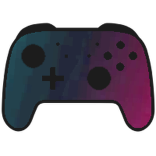
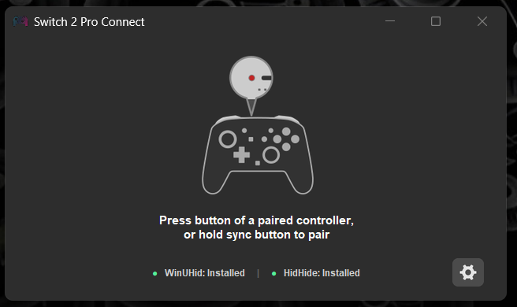
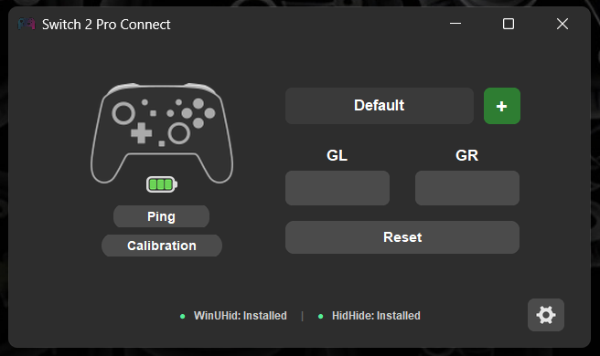

  
  <h1>Switch 2 Pro Connect</h1>

  
  

  
Switch 2 Pro Connect mod focused on the Switch 2 Pro controller and a streamlined UI.

  
Vibe Coded by <a href="https://github.com/sheeshfr"><b>SheeshFr</b></a>

   

  
  &nbsp;
  

## Overview

Switch 2 Pro Connect mod focused on the Switch 2 Pro controller and a streamlined UI:

1. **Switch 2 Pro Controller Exclusively**: Strips out Joy-Con and secondary controller complexity to deliver a dedicated, reliable setup for the Switch 2 Pro Controller over Bluetooth or USB-C.
2. **Convenient Back-Button Assignment**: Quickly remap the GL and GR back paddles by tapping the paddle and pressing the desired target button on the controller. Pressing the **C** button mid-game instantly brings the interface into focus for on-the-fly tweaks.
3. **Automatic Per-Game Profiles**: Assign distinct back-button layouts per game. The app detects active foreground processes and switches profiles automatically as you launch or switch between games.

---

## Setup

1. Download the release archive: [Switch2ProConnect_v1.0_Release.zip](https://github.com/sheeshfr/Switch2ProConnect/releases/download/v1.0/Switch2ProConnect_v1.0_Release.zip).
2. Extract the archive and launch `Switch2ProConnect_v1.0_(ShFr_UI_Mod).exe`.
3. In **Settings**, install the required drivers:
   - **Wireless Driver (WinUHid)** for Bluetooth emulation.
   - **Wired Driver (HidHide)** for USB-C cable play.
4. Connect the controller:
   - **Bluetooth**: Hold the **SYNC** button on the controller until the LEDs cycle; pairing is automatic.
   - **Wired**: Connect via USB-C cable.
5. Map back buttons as desired and configure per-game profiles.

---

## Credits

This mod is based on open-source reverse-engineering and driver development from the community:

- **[TommyWabg/Switch2Connect](https://github.com/TommyWabg/Switch2Connect)**: Base application and architecture.
- **[Nadeflore/switch2-controllers](https://github.com/Nadeflore/switch2-controllers)**: Switch 2 BLE protocol reverse engineering.
- **[lurebat/WinUHid](https://github.com/lurebat/WinUHid)**: Virtual HID driver for controller emulation.
- **[nefarius/ViGEmBus](https://github.com/nefarius/ViGEmBus) & [HidHide](https://github.com/nefarius/HidHide)**: Virtual gamepad emulation framework and device hiding filter driver.
- **[vadimgrn/usbip-win2](https://github.com/vadimgrn/usbip-win2)**: USBIP driver backend.
- **[TheFrano/joycon2py](https://github.com/TheFrano/joycon2py)** & **[german77/JoyconDriver](https://github.com/german77/JoyconDriver)**: Controller protocol references.
- **[LeonChrome/XinHeLianSheng-Pro2-Bridge](https://github.com/LeonChrome/XinHeLianSheng-Pro2-Bridge)** & **[RyanCopley/NSO-GameCube-Controller-Pairing-App](https://github.com/RyanCopley/NSO-GameCube-Controller-Pairing-App)**: Communication and firmware references.

---

## License

Licensed under the [GNU General Public License v3.0 (GPL-3.0)](LICENSE.md). All source code, driver scripts, and build tools are included in this repository.
